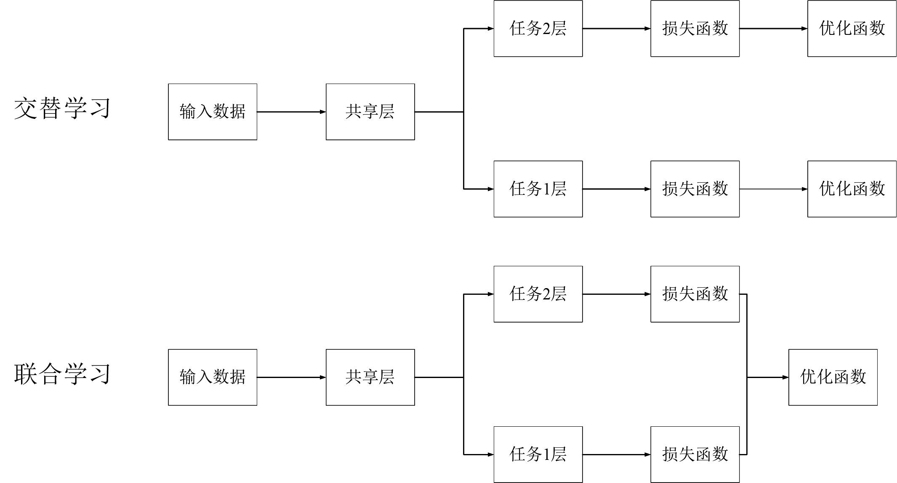
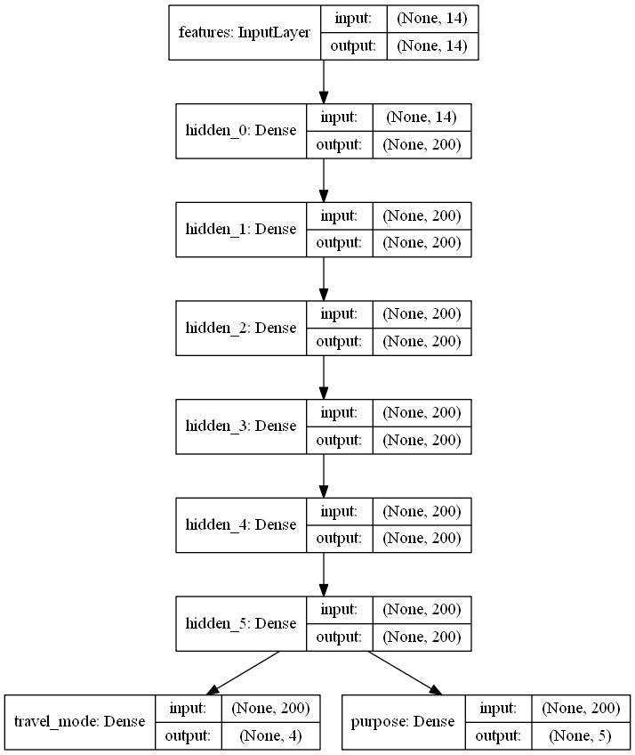

##### 上周组会记录：

1. 单独进行purpose预测
2. 向海江师兄请教多任务预测问题
3. 自主学习多任务预测（keras)

##### 本周进展：

1. purpose预测完成，但精确度不到50%。

2. 对原模型中的build_model()部分进行学习，根据[多任务学习在深度学习中简单使用_wyj_love_wjy的博客-CSDN博客](https://blog.csdn.net/wyj_love_wjy/article/details/88059472)一文，提出多任务学习包含交替学习和联合学习（区别如下图），”**交替学习的概念为模型存在共享层，但是在训练过程中是交替进行的，且损失函数和优化函数是独立的**“，发现之前的想法是可行的，修改之后的代码与其描述的交替学习一致，所以目前完成了交替训练式的多任务预测。

3. 

4. 然后尝试进行联合训练，在对损失函数进行合并的时候一直报错。去请教海江师兄，修改之后依然报错，海江师兄建议我学一下keras。keras根据陈老师给的网站在学习，如下是搭建的结构，具体功能正在学习中。

5. 

6. 后来又找到[Multi-Task Learning in Tensorflow (Part 1) – Jonathan Godwin – Machine Learning (jg8610.github.io)](https://jg8610.github.io/Multi-Task/)一文，确认方法可行。又从资料中查到损失函数使用`tf.reduce_sum(loss_1+loss_2)` ，联合训练也运行成功。

7. 预测结果：

   > 单独进行预测mode (num_model=20)
   >
   > ​	mode accuracy：0.681234802
   >
   > 单独进行预测purpose (num_model=20)
   >
   > ​	purpose accuracy：0.475024696
   >
   > 交替训练多任务预测(num_model=20)
   >
   > ​	mode accuracy： 0.709118541	
   >
   > ​	purpose accuracy： 0.53575228
   >
   > 联合训练多任务预测-1 (num_model=10)(loss 系数均为0.5)
   >
   > ​	mode accuracy：0.708495
   >
   > ​	purpose accuracy：0.533362
   >
   > 联合训练多任务预测-2 (num_model=10)(loss 系数分别为0.3、0.7)
   >
   > ​	mode accuracy：0.718944
   >
   > ​	purpose accuracy：0.517652
   >
   > 联合训练多任务预测-3 (num_model=10)(loss 系数分别为0.7、0.3)
   >
   > ​	mode accuracy：0.698716
   >
   > ​	purpose accuracy：0.541390578

##### 计划：

1. 学习一下keras的多任务预测
2. 调整一下现有预测的参数，找到最佳系数；或者更改其他函数作为损失函数进行训练
